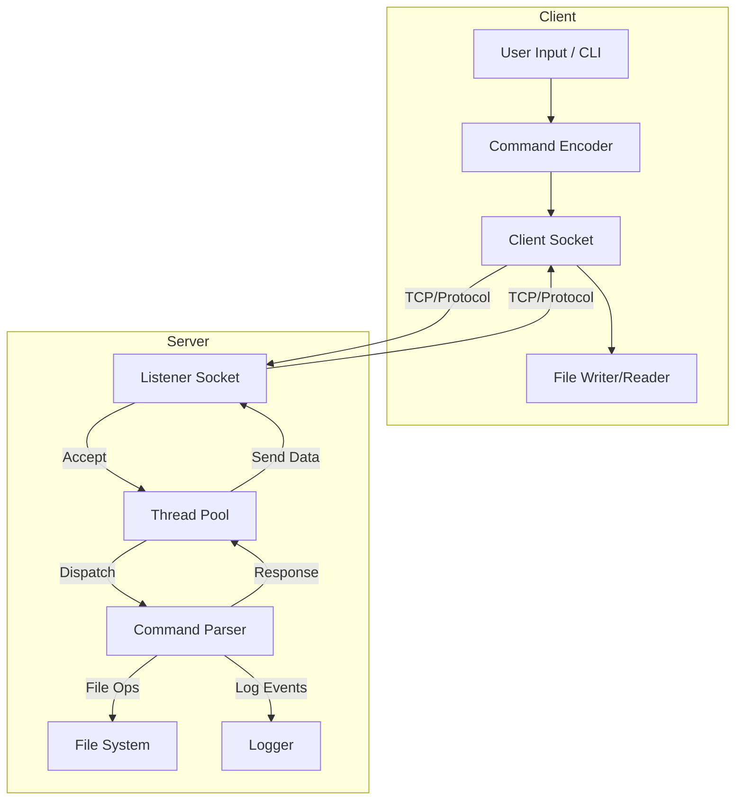

# Advanced Multi-Threaded Python File Transfer System

## Overview

This project is a robust, feature-rich, and extensible client-server file transfer system implemented in Python. It supports both single-threaded and multi-threaded server architectures, enabling efficient, concurrent file transfers and advanced commands such as directory listing, batch downloads, uploads, chat messaging, and authentication.

The system is designed for reliability, security, and scalability, making it suitable for educational, research, or light enterprise use cases.

---

## Scope

- **Single-threaded and multi-threaded file servers**
- **Interactive and scriptable clients**
- **Concurrent file transfers with resource control**
- **Directory listing, batch, and single file operations**
- **Secure authentication and safe filename handling**
- **File upload, chat, and extensible command protocol**
- **Progress bars, logging, and graceful shutdown**

---

## Dataflow Diagram



---

## Features

- **Multi-threaded server:** Handles many clients concurrently using a thread pool.
- **Single-threaded server:** Simpler, for comparison or low-load scenarios.
- **Interactive client:** Command-line interface for issuing commands and receiving files.
- **Authentication:** Username/password required for access (configurable).
- **Directory listing:** Clients can request a list of available files.
- **Batch download:** Download multiple files in a single command.
- **File upload:** Clients can upload files to the server (stored in `uploads/`).
- **Chat/message:** Send and receive chat messages (echoed by the server).
- **Progress bars:** Visual feedback for file transfers (uses `tqdm` if installed).
- **Safe filename validation:** Prevents directory traversal and unsafe names.
- **Protocol versioning:** Ensures client and server compatibility.
- **Configurable buffer size, port, and credentials:** Via CLI or environment.
- **Logging:** To both file and console for easy debugging and monitoring.
- **Graceful shutdown:** Handles SIGINT/SIGTERM for safe server exit.
- **Extensible protocol:** Easy to add new commands and features.

---

## Installation

### Prerequisites
- Python 3.7+
- (Optional, for progress bars) `tqdm`: Install with `pip install tqdm`

### Clone the Repository
```bash
git clone <your-repo-url>
cd adv
```

### Install Dependencies (optional)
```bash
pip install tqdm
```

---

## Usage

### Start the Multi-Threaded Server
```bash
python3 server_threaded+files.py --port 22223
```
Or set via environment:
```bash
export FT_PORT=22223
export FT_USER=myuser
export FT_PASS=mypass
python3 server_threaded+files.py
```

### Start the Client
```bash
python3 client_threaded+files.py --host localhost --port 22223 --user myuser --password mypass
```

### Client Commands
- `LIST` — List available files on the server.
- `FILE` — Download a single file.
- `BATCH` — Download multiple files (comma-separated list).
- `UPLOAD` — Upload a file to the server (stored in `uploads/`).
- `CHAT` — Send a chat message (server echoes it back).
- `EXIT` — Disconnect from the server.

### Example Session
```
$ python3 client_threaded+files.py --host localhost --port 22223 --user user --password pass123
Connected to localhost:22223
Authentication succeeded.
Enter command (EXIT, LIST, CHAT, FILE, BATCH, UPLOAD): LIST
file1.txt - 12345 bytes
file2.txt - 67890 bytes
Enter command (EXIT, LIST, CHAT, FILE, BATCH, UPLOAD): FILE
Enter file name: file1.txt
Downloaded downloaded_file1.txt (12345 bytes)
Enter command (EXIT, LIST, CHAT, FILE, BATCH, UPLOAD): EXIT
Connection closed
```

---

## Security Notes
- All file operations validate filenames for safety.
- Authentication is required and can be configured.
- Uploaded files are stored in a dedicated `uploads/` directory.
- For production use, consider adding TLS encryption and user management.

---

## Extending the System
- Add new commands by updating the command parser in both server and client.
- Use the shared `utils.py` for protocol helpers and security.
- Expand automated tests in `tests/` for new features.

---

## License
MIT License (or specify your own)

---

## Authors
- Your Name Here
- Contributors Welcome!

---

## Support
For questions or contributions, open an issue or pull request.

---

*Happy transferring!*
